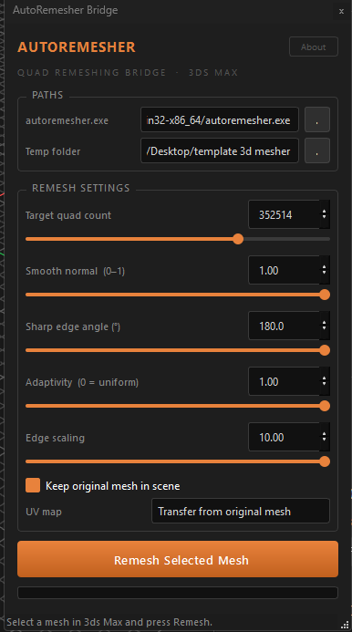
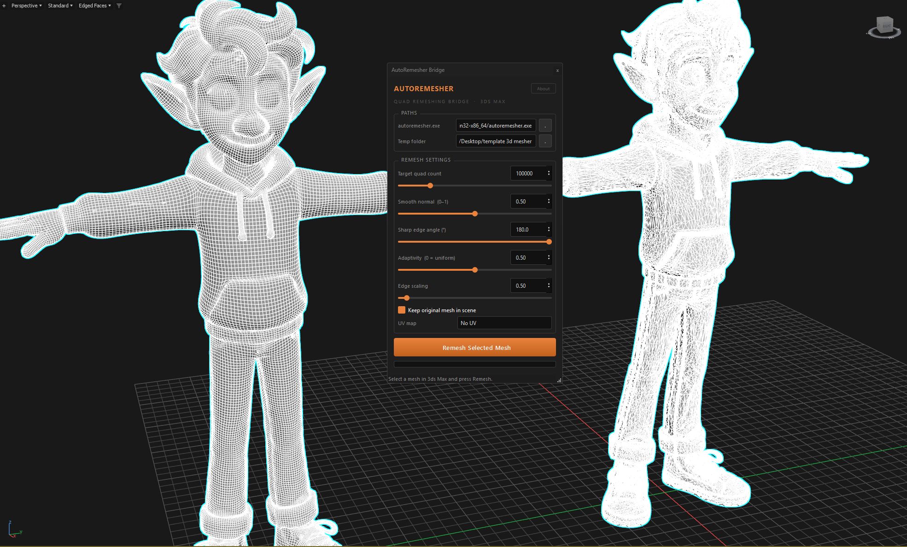

# AutoRemesher Bridge for 3ds Max

A Python + PySide6 Script that connects [huxingyi/autoremesher](https://github.com/huxingyi/autoremesher) to **3ds Max**, giving you a dark-themed floating UI to quad-remesh any mesh without leaving Max.

[](https://www.paypal.com/donate/?hosted_button_id=LAMNRY6DDWDC4)


---




---

## Features

- Full UI with sliders for all 5 autoremesher parameters
- Runs remeshing in a background thread — Max stays responsive
- UV options: keep auto-UV from remesher, transfer from original mesh, or plain UVW map
- Remembers all settings between sessions (QSettings)
- Matches 3ds Max dark skin

---

## Requirements

| Requirement | Version |
|---|---|
| 3ds Max | 2022 or later |
| Python (bundled with Max) | 3.x |
| PySide6 | install via Max's pip |
| autoremesher CLI | [download here](https://github.com/huxingyi/autoremesher/releases) |


---

## 📦 Installation

1. Copy the project folder to your **3ds Max scripts** directory.
2. Launch `autoremesher_bridge.py` from the **Scripting > Run Script...** menu.
3. Set your material root folder from **Settings**.

or

## 📦 Installation

Installing the plugin is quick and requires no manual setup in 3ds Max.

1. **Unzip** the downloaded package.
2. **Copy** the `.bundle` folder to the Autodesk Application Plugins directory:
   ```text
   C:\ProgramData\Autodesk\ApplicationPlugins
   
---

## Parameters

| Parameter | Description | Default |
|---|---|---|
| **Target quad count** | Desired number of quads in the output mesh | 2 000 |
| **Smooth normal** | Normal smoothing (0 = sharp edges, 1 = fully smooth) | 0.5 |
| **Sharp edge angle** | Angle threshold for preserving hard edges (degrees) | 180 |
| **Adaptivity** | 0 = uniform quad size, 1 = adaptive to surface detail | 1.0 |
| **Edge scaling** | Global scale multiplier for edge length | 1.0 |

---

## UV Options

| Mode | Description |
|---|---|
| Keep from remesher | Uses the UV layout autoremesher generates automatically |
| Transfer from original | Projects the original mesh's UVs onto the remeshed result via 3ds Max Projection modifier |
| No UV | Applies a basic UVW Map modifier to the result |

---

## Workflow

1. Select a mesh object in the 3ds Max viewport.
2. Open the bridge UI (`autoremesher_bridge.launch()`).
3. Set the path to `autoremesher.exe` and optionally change the temp folder.
4. Adjust remesh settings with the sliders.
5. Choose a UV mode.
6. Click **Remesh Selected Mesh**.

The result is imported back into the scene as `<original_name>_remeshed`, placed at the same world-space position as the original.

---

## License

MIT License — © 2026 Iman Shirani
